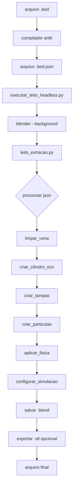

# scripts python blender - guia completo

## 📋 visão geral

os scripts python do blender automatizam a criação de geometrias 3d de leitos empacotados, usando a poderosa api do blender para:
- modelagem procedural
- física rigid body
- exportação stl para cfd

---

## 📁 estrutura dos scripts

```
scripts/
├── blender_scripts/
│   ├── leito_extracao.py          # script principal (500+ linhas)
│   └── cubo_oco.py                 # geometria alternativa (cubo)
└── standalone_scripts/
    └── executar_leito_headless.py  # executor headless
```

---

## 🎨 leito_extracao.py - script principal

### imports e dependências

```python
import bpy  # api do blender (modelagem 3d, física, renderização)
import math  # cálculos geométricos
import random  # distribuição aleatória de partículas
import json  # leitura de params.json
import sys  # argumentos da linha de comando
import argparse  # parsing de argumentos
from pathlib import Path  # manipulação de caminhos
```

**dependências**:
- **bpy**: módulo nativo do blender, disponível apenas dentro do blender
- **json**: leitura de parâmetros do compilador dsl
- **argparse**: interface cli para headless mode

---

### 1. limpar_cena()

**função**: remove todos os objetos da cena blender

```python
def limpar_cena():
    """
    remove todos os objetos da cena
    
    fundamentação:
    - garante ambiente limpo antes de gerar geometria
    - previne conflitos com objetos pré-existentes
    """
    bpy.ops.object.select_all(action='SELECT')  # selecionar tudo
    bpy.ops.object.delete(use_global=False)     # deletar
    print("cena limpa")
```

**quando usar**:
- **sempre** no início da geração
- após abrir arquivo .blend existente
- antes de rodar script em batch

**equivalente manual**:
1. selecionar todos (a)
2. deletar (x → delete)

---

### 2. criar_cilindro_oco()

**função**: cria cilindro oco (parede do leito)

```python
def criar_cilindro_oco(altura=0.1, diametro_externo=0.025, 
                       espessura_parede=0.002):
    """
    cria cilindro oco usando operação booleana
    
    parâmetros:
        altura: altura do cilindro [m]
        diametro_externo: diâmetro externo [m]
        espessura_parede: espessura da parede [m]
    
    retorna:
        objeto blender (cilindro_externo)
    
    fundamentação:
    - conlan (2017, cap. 3): modelagem procedural
    - operação booleana DIFFERENCE para criar oco
    """
    
    # calcular raios
    raio_externo = diametro_externo / 2
    raio_interno = raio_externo - espessura_parede
    
    # 1. criar cilindro externo
    bpy.ops.mesh.primitive_cylinder_add(
        radius=raio_externo,
        depth=altura,
        location=(0, 0, altura/2)  # centrar na origem
    )
    cilindro_externo = bpy.context.active_object
    cilindro_externo.name = "leito_extracao"
    
    # 2. criar cilindro interno (furo)
    bpy.ops.mesh.primitive_cylinder_add(
        radius=raio_interno,
        depth=altura + 0.01,  # um pouco maior para cortar bem
        location=(0, 0, altura/2)
    )
    cilindro_interno = bpy.context.active_object
    cilindro_interno.name = "furo_temporario"
    
    # 3. operação booleana (subtração)
    bool_mod = cilindro_externo.modifiers.new(
        name="Boolean", 
        type='BOOLEAN'
    )
    bool_mod.operation = 'DIFFERENCE'  # externo - interno
    bool_mod.object = cilindro_interno
    
    # 4. aplicar modificador
    bpy.context.view_layer.objects.active = cilindro_externo
    bpy.ops.object.modifier_apply(modifier="Boolean")
    
    # 5. remover cilindro interno temporário
    bpy.data.objects.remove(cilindro_interno, do_unlink=True)
    
    print(f"leito criado: altura={altura}m, diametro={diametro_externo}m")
    return cilindro_externo
```

**conceitos-chave**:

1. **operação booleana**: álgebra de sólidos
   - UNION: a ∪ b
   - DIFFERENCE: a - b (usado aqui)
   - INTERSECT: a ∩ b

2. **modificadores**: transformações não-destrutivas
   - podem ser empilhados
   - aplicados com `modifier_apply()`

3. **localização**: posição (x, y, z) em metros
   - origem (0, 0, 0) no centro da cena
   - z aponta para cima

**parâmetros típicos**:

| parâmetro | valor típico | mín | máx |
|-----------|--------------|-----|-----|
| altura | 0.1 m | 0.05 | 1.0 |
| diametro_externo | 0.05 m | 0.02 | 0.5 |
| espessura_parede | 0.002 m | 0.001 | 0.01 |

---

### 3. criar_tampa()

**função**: cria tampas inferior e superior do leito

```python
def criar_tampa(posicao_z, diametro=0.025, espessura=0.003, 
                nome="tampa"):
    """
    cria tampa circular (cilindro achatado)
    
    parâmetros:
        posicao_z: altura vertical da tampa [m]
        diametro: diâmetro da tampa [m]
        espessura: espessura da tampa [m]
        nome: identificador do objeto
    
    retorna:
        objeto blender (tampa)
    """
    
    bpy.ops.mesh.primitive_cylinder_add(
        radius=diametro/2,
        depth=espessura,
        location=(0, 0, posicao_z)
    )
    tampa = bpy.context.active_object
    tampa.name = nome
    
    print(f"{nome} criada na posicao z={posicao_z}m")
    return tampa
```

**uso típico**:
```python
# tampa inferior
tampa_inf = criar_tampa(posicao_z=0, diametro=0.05, nome="tampa_inferior")

# tampa superior
tampa_sup = criar_tampa(posicao_z=0.1, diametro=0.05, nome="tampa_superior")
```

**nota**: tampa superior deve ter colisão desabilitada para partículas caírem!

---

### 4. criar_particulas()

**função**: gera partículas esféricas aleatórias dentro do leito

```python
def criar_particulas(quantidade=30, raio_leito=0.0125, 
                    altura_leito=0.1, raio_particula=0.001):
    """
    cria esferas que cairão no leito por gravidade
    
    parâmetros:
        quantidade: número de partículas
        raio_leito: raio interno do cilindro [m]
        altura_leito: altura do leito [m]
        raio_particula: raio de cada esfera [m]
    
    retorna:
        lista de objetos blender (partículas)
    
    fundamentação:
    - brito (2018, cap. 9): física rigid body
    - distribuição aleatória uniforme
    """
    
    particulas = []
    
    for i in range(quantidade):
        # posição aleatória acima do leito
        # (para partículas caírem por gravidade)
        x = random.uniform(-raio_leito*0.8, raio_leito*0.8)
        y = random.uniform(-raio_leito*0.8, raio_leito*0.8)
        z = altura_leito + 0.05 + random.uniform(0, 0.1)
        
        # verificar se está dentro do cilindro
        distancia_centro = math.sqrt(x**2 + y**2)
        if distancia_centro < (raio_leito - raio_particula):
            # criar esfera
            bpy.ops.mesh.primitive_uv_sphere_add(
                radius=raio_particula,
                location=(x, y, z),
                segments=16,  # resolução (16 = baixa, 32 = alta)
                ring_count=8
            )
            particula = bpy.context.active_object
            particula.name = f"particula_{i:03d}"
            particulas.append(particula)
    
    print(f"{len(particulas)} particulas criadas")
    return particulas
```

**distribuição espacial**:

```
vista superior (plano xy):
     
     +y
      |
   ┌──┼──┐  raio_leito = 0.0125m
   │  │  │  
───┼──+──┼──→ +x
   │     │  
   └─────┘
   
partículas distribuídas em:
- x: [-0.01, +0.01]  (80% do raio)
- y: [-0.01, +0.01]
- z: [0.15, 0.25]    (acima do leito)
```

**parâmetros de qualidade**:

| parâmetro | efeito | valor baixo | valor alto |
|-----------|--------|-------------|------------|
| `segments` | resolução angular | 8 (rápido) | 32 (suave) |
| `ring_count` | resolução vertical | 4 | 16 |
| `quantidade` | número partículas | 10 (teste) | 500 (real) |

---

### 5. aplicar_fisica()

**função**: configura física rigid body para simulação de empacotamento

```python
def aplicar_fisica(obj, tipo='PASSIVE'):
    """
    aplica física rigid body ao objeto
    
    parâmetros:
        obj: objeto blender
        tipo: 'PASSIVE' (estático) ou 'ACTIVE' (dinâmico)
    
    tipos de corpo rígido:
        PASSIVE: não se move, recebe colisões
                 uso: leito, tampas
        
        ACTIVE: cai por gravidade, colide
                uso: partículas
    
    fundamentação:
    - brito (2018, cap. 9): simulação física
    - cutec (2025): parâmetros de esferas de vidro
    """
    
    # adicionar rigid body
    bpy.context.view_layer.objects.active = obj
    bpy.ops.rigidbody.object_add(type=tipo)
    
    # configurar propriedades
    obj.rigid_body.collision_shape = 'MESH'  # malha completa
                                            # ou: 'SPHERE', 'BOX', 'CONVEX_HULL'
    
    if tipo == 'ACTIVE':
        # partículas dinâmicas
        obj.rigid_body.mass = calcular_massa_particula(obj)
        obj.rigid_body.friction = 0.5        # atrito (0-1)
        obj.rigid_body.restitution = 0.3    # restituição (0-1)
                                            # 0 = inelástica
                                            # 1 = elástica perfeita
        obj.rigid_body.linear_damping = 0.04  # amortecimento linear
        obj.rigid_body.angular_damping = 0.1  # amortecimento angular
    
    else:
        # geometria estática
        obj.rigid_body.kinematic = False
        obj.rigid_body.mass = 1.0
```

**propriedades físicas**:

| propriedade | partícula (active) | leito (passive) |
|-------------|-------------------|-----------------|
| mass | calculada (ρ×V) | 1.0 |
| friction | 0.5 | 0.5 |
| restitution | 0.3 | 0.3 |
| damping | 0.04 | 0.0 |

**tipos de colisão**:

| tipo | precisão | performance | uso |
|------|----------|-------------|-----|
| `MESH` | alta | baixa | leito oco |
| `CONVEX_HULL` | média | média | tampas |
| `SPHERE` | baixa | alta | partículas simples |
| `BOX` | baixa | alta | testes |

**exemplo de cálculo de massa**:

```python
def calcular_massa_particula(obj):
    """
    calcula massa baseada em volume e densidade
    
    para esferas de vidro (cutec, 2025):
        ρ = 2500 kg/m³
        V = (4/3)πr³
    """
    raio = obj.dimensions.x / 2  # assumindo esfera
    volume = (4/3) * math.pi * raio**3
    densidade = 2500  # kg/m³ (vidro)
    massa = densidade * volume
    return massa
```

---

### 6. configurar_simulacao_fisica()

**função**: configura parâmetros globais de simulação física

```python
def configurar_simulacao_fisica(gravidade=-9.81, substeps=20, iterations=10):
    """
    configura mundo físico do blender
    
    parâmetros:
        gravidade: aceleração da gravidade [m/s²]
        substeps: subdivisões por frame (precisão)
        iterations: iterações do solver (estabilidade)
    
    fundamentação:
    - blender documentation (2025)
    - valores padrão otimizados para empacotamento
    """
    
    scene = bpy.context.scene
    
    # habilitar rigid body world
    if not scene.rigidbody_world:
        bpy.ops.rigidbody.world_add()
    
    # configurar gravidade
    if hasattr(scene.rigidbody_world, 'gravity'):
        scene.rigidbody_world.gravity = (0, 0, gravidade)
    
    # configurar qualidade da simulação
    if hasattr(scene.rigidbody_world, 'substeps_per_frame'):
        scene.rigidbody_world.substeps_per_frame = substeps
    
    if hasattr(scene.rigidbody_world, 'solver_iterations'):
        scene.rigidbody_world.solver_iterations = iterations
    
    print(f"fisica configurada: g={gravidade} m/s², substeps={substeps}")
```

**parâmetros de qualidade**:

| qualidade | substeps | iterations | tempo simulação |
|-----------|----------|------------|-----------------|
| baixa | 10 | 5 | rápido |
| **média** | **20** | **10** | **moderado** |
| alta | 50 | 20 | lento |
| ultra | 100 | 50 | muito lento |

**quando aumentar substeps/iterations**:
- partículas atravessando paredes
- colisões instáveis
- empacotamento não realista
- interpenetrações

---

### 7. ler_parametros_json()

**função**: carrega parâmetros do arquivo .bed.json

```python
def ler_parametros_json(json_path):
    """
    lê arquivo json gerado pelo compilador dsl
    
    parâmetro:
        json_path: caminho para arquivo .bed.json
    
    retorna:
        dicionário com parâmetros do leito
    
    estrutura esperada:
        {
            "bed": {
                "diameter": 0.05,
                "height": 0.1,
                "wall_thickness": 0.002
            },
            "particles": {
                "count": 100,
                "diameter": 0.005,
                "kind": "sphere"
            },
            "packing": {
                "method": "rigid_body",
                "substeps": 20
            },
            "export": {
                "formats": ["blend", "stl"]
            }
        }
    """
    
    with open(json_path, 'r', encoding='utf-8') as f:
        params = json.load(f)
    
    print(f"parametros carregados de: {json_path}")
    return params
```

**integração dsl → blender**:

```
.bed file → antlr compiler → .bed.json → blender script → .blend file
```

**exemplo de uso**:
```python
params = ler_parametros_json("leito01.bed.json")

# extrair valores
diametro = params['bed']['diameter']
altura = params['bed']['height']
num_particulas = params['particles']['count']

# criar geometria
cilindro = criar_cilindro_oco(altura, diametro)
particulas = criar_particulas(num_particulas, diametro/2, altura)
```

---

### 8. main_com_parametros()

**função**: ponto de entrada principal do script

```python
def main_com_parametros():
    """
    execução principal com argumentos cli
    
    uso:
        blender --background --python leito_extracao.py -- \
            --params leito01.bed.json \
            --output leito01.blend
    
    fluxo:
        1. parsear argumentos
        2. carregar parâmetros json
        3. limpar cena
        4. criar geometria (leito + partículas)
        5. aplicar física
        6. configurar simulação
        7. executar animação (opcional)
        8. salvar arquivo .blend
        9. exportar .stl (opcional)
    """
    
    import traceback
    
    try:
        # 1. parsear argumentos
        parser = argparse.ArgumentParser()
        parser.add_argument('--params', required=True, 
                          help='caminho para arquivo .bed.json')
        parser.add_argument('--output', required=True, 
                          help='caminho para salvar .blend')
        
        # blender passa argumentos após '--'
        argv = sys.argv[sys.argv.index("--") + 1:]
        args = parser.parse_args(argv)
        
        print("="*50)
        print(" gerando modelo 3d com blender")
        print("="*50)
        
        # 2. carregar parâmetros
        params = ler_parametros_json(args.params)
        
        # extrair valores
        bed = params.get('bed', {})
        particles = params.get('particles', {})
        packing = params.get('packing', {})
        
        altura = bed.get('height', 0.1)
        diametro = bed.get('diameter', 0.05)
        espessura = bed.get('wall_thickness', 0.002)
        
        num_particulas = particles.get('count', 100)
        diametro_particula = particles.get('diameter', 0.005)
        
        substeps = packing.get('substeps', 20)
        
        # 3. limpar cena
        limpar_cena()
        
        # 4. criar geometria
        print("\ncriando leito...")
        leito = criar_cilindro_oco(altura, diametro, espessura)
        
        print("\ncriando tampas...")
        tampa_inf = criar_tampa(posicao_z=0, diametro=diametro, 
                               nome="tampa_inferior")
        tampa_sup = criar_tampa(posicao_z=altura, diametro=diametro, 
                               nome="tampa_superior")
        
        print("\ncriando particulas...")
        raio_leito = (diametro/2) - espessura
        raio_particula = diametro_particula / 2
        particulas = criar_particulas(num_particulas, raio_leito, 
                                      altura, raio_particula)
        
        # 5. aplicar física
        print("\naplicando fisica...")
        aplicar_fisica(leito, tipo='PASSIVE')
        aplicar_fisica(tampa_inf, tipo='PASSIVE')
        # tampa superior sem colisão para partículas caírem
        
        for p in particulas:
            aplicar_fisica(p, tipo='ACTIVE')
        
        # 6. configurar simulação
        print("\nconfigurando simulacao fisica...")
        configurar_simulacao_fisica(substeps=substeps)
        
        # 7. salvar arquivo
        output_path = Path(args.output)
        output_path.parent.mkdir(parents=True, exist_ok=True)
        
        print(f"\nsalvando arquivo: {output_path}")
        bpy.ops.wm.save_as_mainfile(filepath=str(output_path))
        
        print("\n[OK] modelo 3d gerado com sucesso!")
        print(f"arquivo salvo: {output_path}")
        
    except Exception as e:
        print(f"\n[ERRO] falha ao gerar modelo:")
        print(str(e))
        traceback.print_exc()
        sys.exit(1)


# executar se rodado como script
if __name__ == "__main__":
    main_com_parametros()
```

---

## 🖥️ executar_leito_headless.py

**função**: executor para rodar blender em modo headless (sem gui)

```python
import subprocess
import sys
from pathlib import Path

def encontrar_blender():
    """
    busca executável do blender em locais comuns
    
    retorna:
        caminho para blender.exe ou None
    """
    caminhos_possiveis = [
        r"C:\Program Files\Blender Foundation\Blender 4.0\blender.exe",
        r"C:\Program Files\Blender Foundation\Blender 3.6\blender.exe",
        "/usr/bin/blender",  # linux
        "/Applications/Blender.app/Contents/MacOS/Blender"  # macos
    ]
    
    for caminho in caminhos_possiveis:
        if Path(caminho).exists():
            return caminho
    
    return None


def executar_blender_headless(script_path, json_path, output_path):
    """
    executa script blender em modo headless
    
    parâmetros:
        script_path: caminho para leito_extracao.py
        json_path: caminho para params.json
        output_path: caminho para salvar .blend
    
    comando gerado:
        blender --background --python leito_extracao.py -- \
            --params params.json \
            --output output.blend
    """
    
    blender_exe = encontrar_blender()
    if not blender_exe:
        print("[ERRO] blender nao encontrado!")
        sys.exit(1)
    
    print(f"executando blender headless...")
    print(f"script: {script_path}")
    print(f"json: {json_path}")
    print(f"output: {output_path}")
    
    comando = [
        blender_exe,
        "--background",          # sem gui
        "--python", script_path,  # executar script
        "--",                     # separador de argumentos
        "--params", json_path,
        "--output", output_path
    ]
    
    try:
        resultado = subprocess.run(
            comando,
            capture_output=True,
            text=True,
            timeout=300  # timeout 5 minutos
        )
        
        print(resultado.stdout)
        
        if resultado.returncode == 0:
            print("[OK] modelo gerado!")
            return True
        else:
            print("[ERRO] falha na execucao:")
            print(resultado.stderr)
            return False
            
    except subprocess.TimeoutExpired:
        print("[ERRO] timeout! processo demorou mais de 5 minutos")
        return False
```

---

## 📊 fluxo completo de execução



---

## 🔧 troubleshooting

### erros comuns

| erro | causa | solução |
|------|-------|---------|
| `ModuleNotFoundError: No module named 'bpy'` | rodando fora do blender | executar dentro do blender |
| `FileNotFoundError: params.json` | caminho incorreto | verificar path absoluto |
| `RuntimeError: object has no rigid_body` | física não aplicada | chamar aplicar_fisica() |
| `Memory error` | muitas partículas | reduzir quantidade |

### dicas de performance

1. **reduzir resolução de esferas**: segments=8 (teste), 16 (produção)
2. **diminuir substeps**: 10 (rápido), 20 (qualidade)
3. **limitar partículas**: 100-200 para testes, 500-1000 produção
4. **usar collision_shape='SPHERE'**: mais rápido que 'MESH'

---

## 📚 referências

- conlan, c. (2017). the blender python api: add-on development. apress.
- brito, a. (2018). blender quick start guide. packt.
- blender foundation (2025). blender python api. https://docs.blender.org/api/
- mdpi (2025). synthetic packed-bed generation for cfd simulations. https://www.mdpi.com/2305-7084/3/2/52

---

**última atualização**: 9 outubro 2025  
**versão**: 1.0

