# diagramas uml completos do projeto cfd-pipeline-tcc

este documento contem todos os diagramas uml do projeto, incluindo classes, componentes, sequencia, estados e fluxo de dados.

## indice

1. [diagrama geral de componentes](#1-diagrama-geral-de-componentes)
2. [diagrama de classes - dsl](#2-diagrama-de-classes---dsl)
3. [diagrama de classes - blender](#3-diagrama-de-classes---blender)
4. [diagrama de classes - openfoam](#4-diagrama-de-classes---openfoam)
5. [diagrama de sequencia - fluxo completo](#5-diagrama-de-sequencia---fluxo-completo)
6. [diagrama de estados - pipeline](#6-diagrama-de-estados---pipeline)
7. [diagrama entidade-relacionamento](#7-diagrama-entidade-relacionamento---parametros)
8. [diagrama de dependencias](#8-diagrama-de-dependencias-entre-arquivos)
9. [diagrama de fluxo de dados](#9-diagrama-de-fluxo-de-dados)
10. [diagrama detalhado - bed_wizard](#10-diagrama-de-classes-detalhado---bed_wizard)
11. [metricas das classes](#11-diagrama-de-metricas-das-classes)
12. [glossario de tipos](#12-glossario-de-tipos)

---

## 1. diagrama geral de componentes

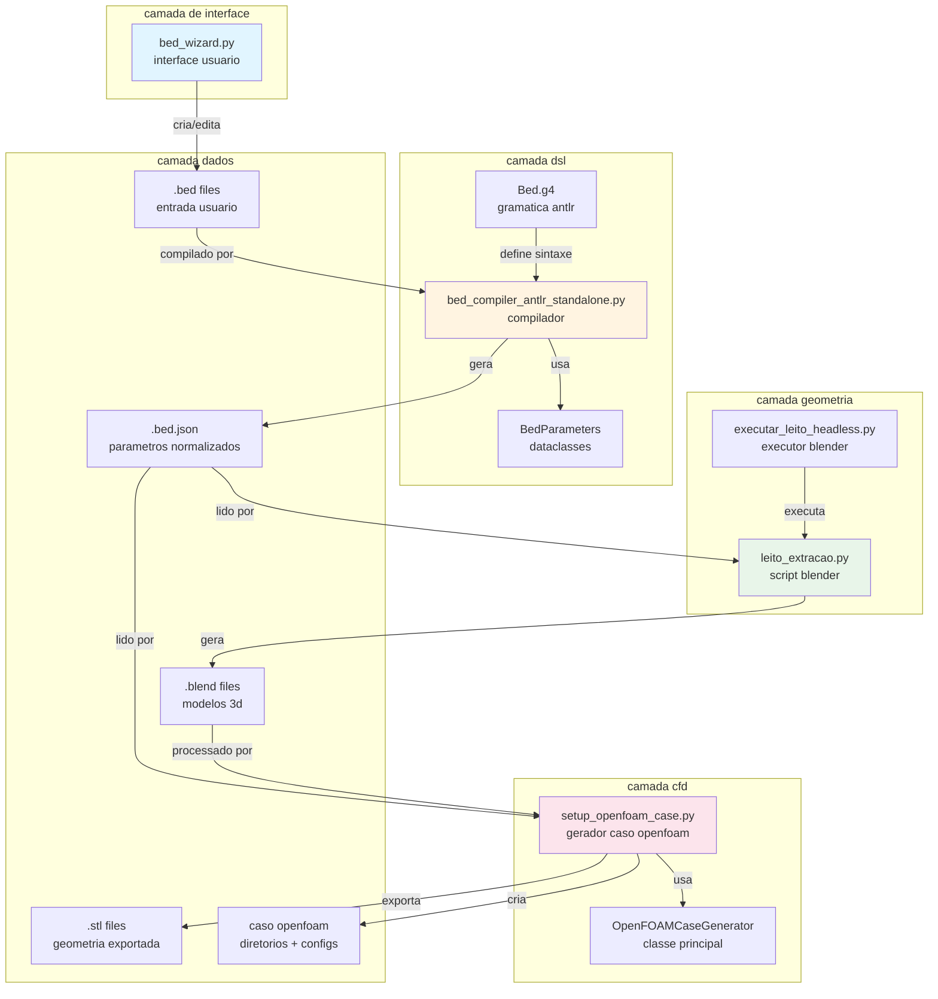

---

## 2. diagrama de classes - dsl

### 2.1 classes de parametros (dataclasses)

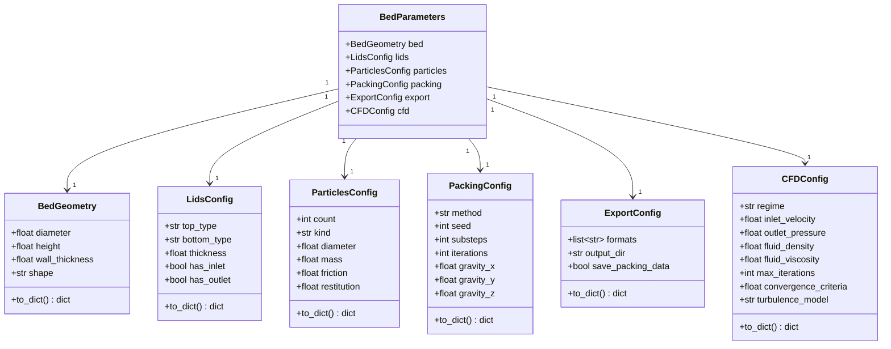

### 2.2 classes do compilador

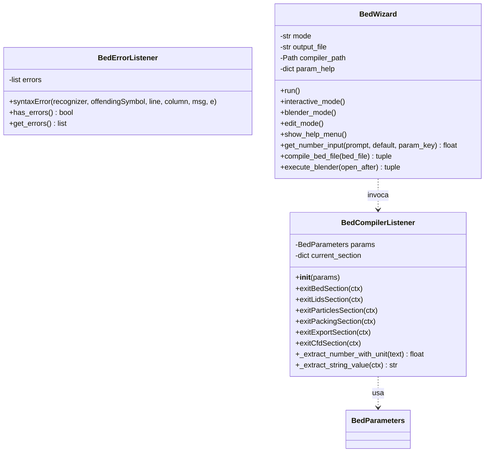

---

## 3. diagrama de classes - blender

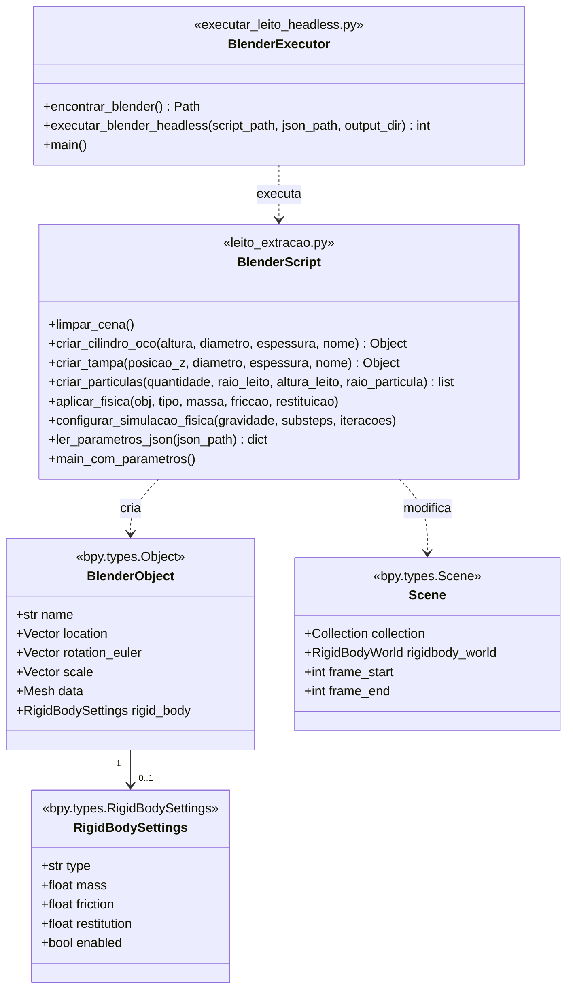

---

## 4. diagrama de classes - openfoam

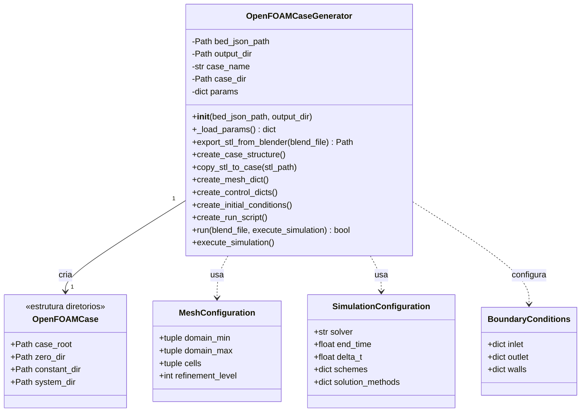

---

## 5. diagrama de sequencia - fluxo completo

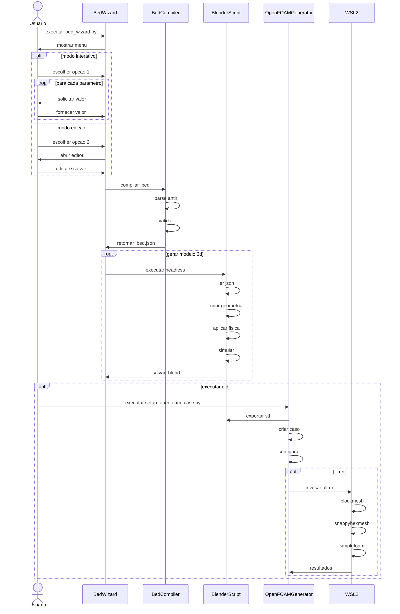

---

## 6. diagrama de estados - pipeline

```mermaid
stateDiagram-v2
    [*] --> Inicial
    
    Inicial --> DefiniParametros : usuario inicia wizard
    
    DefiniParametros --> EdicaoInterativa : modo 1
    DefiniParametros --> EdicaoManual : modo 2
    DefiniParametros --> ModoBlender : modo 3
    
    EdicaoInterativa --> ArquivoBed : responder questoes
    EdicaoManual --> ArquivoBed : editar arquivo
    ModoBlender --> ArquivoBed : definir geometria
    
    ArquivoBed --> Compilacao : salvar .bed
    
    Compilacao --> ValidacaoSintaxe : invocar antlr
    ValidacaoSintaxe --> ErroSintaxe : sintaxe invalida
    ValidacaoSintaxe --> ConversaoUnidades : sintaxe valida
    
    ErroSintaxe --> DefiniParametros : corrigir
    
    ConversaoUnidades --> GeracaoJson : normalizar SI
    GeracaoJson --> JsonGerado : salvar .bed.json
    
    JsonGerado --> GeracaoModelo3D : modo blender
    JsonGerado --> AguardandoAcao : modo interativo
    
    GeracaoModelo3D --> ExecutarBlender
    ExecutarBlender --> LimparCena
    LimparCena --> CriarLeito
    CriarLeito --> CriarParticulas
    CriarParticulas --> AplicarFisica
    AplicarFisica --> SimularEmpacotamento
    SimularEmpacotamento --> SalvarBlend
    
    SalvarBlend --> ModeloGerado
    ModeloGerado --> AguardandoAcao
    
    AguardandoAcao --> ConfigurarCFD : executar setup_openfoam_case.py
    
    ConfigurarCFD --> ExportarSTL
    ExportarSTL --> CriarEstruturaCaso
    CriarEstruturaCaso --> ConfigurarSolver
    ConfigurarSolver --> CasoConfigurado
    
    CasoConfigurado --> ExecutarSimulacao : --run
    CasoConfigurado --> Finalizado : sem --run
    
    ExecutarSimulacao --> ExecutarBlockMesh
    ExecutarBlockMesh --> ExecutarSnappyHexMesh
    ExecutarSnappyHexMesh --> ExecutarSimpleFoam
    ExecutarSimpleFoam --> SimulacaoCompleta : convergiu
    ExecutarSimpleFoam --> ErroSimulacao : divergiu
    
    SimulacaoCompleta --> Finalizado
    ErroSimulacao --> ConfigurarCFD : ajustar
    
    Finalizado --> [*]
```

---

## 7. diagrama entidade-relacionamento - parametros

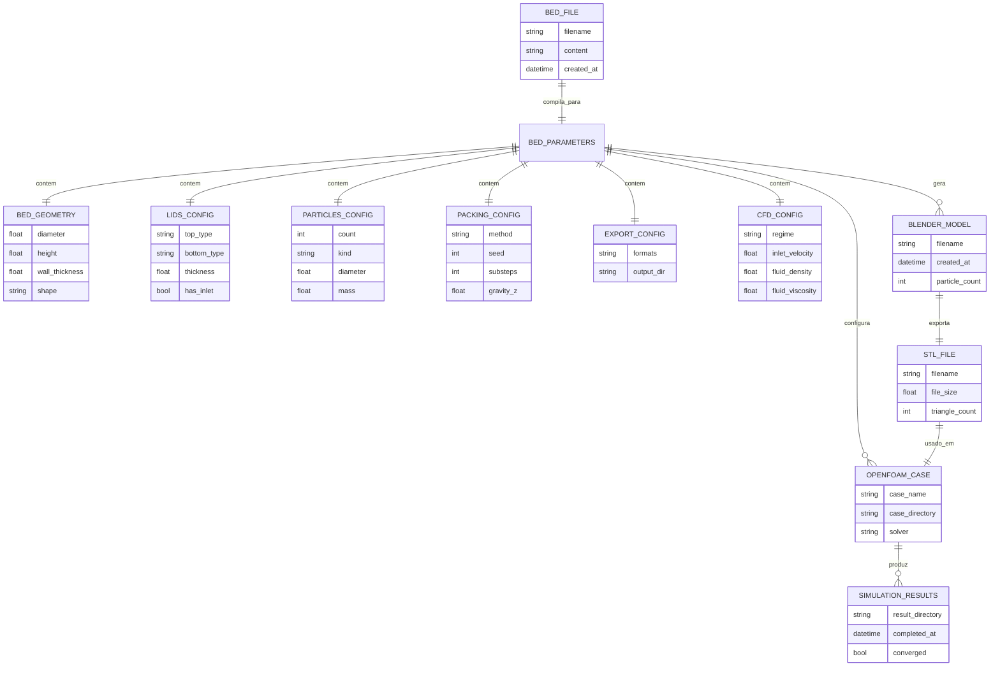

---

## 8. diagrama de dependencias entre arquivos

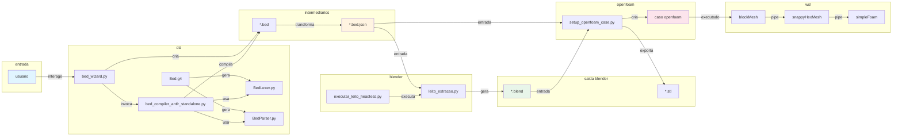

---

## 9. diagrama de fluxo de dados

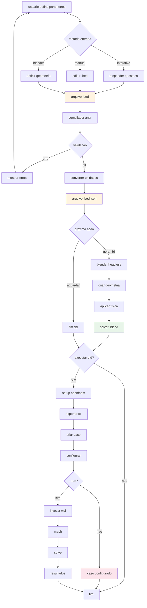

---

## 10. diagrama de classes detalhado - bed_wizard

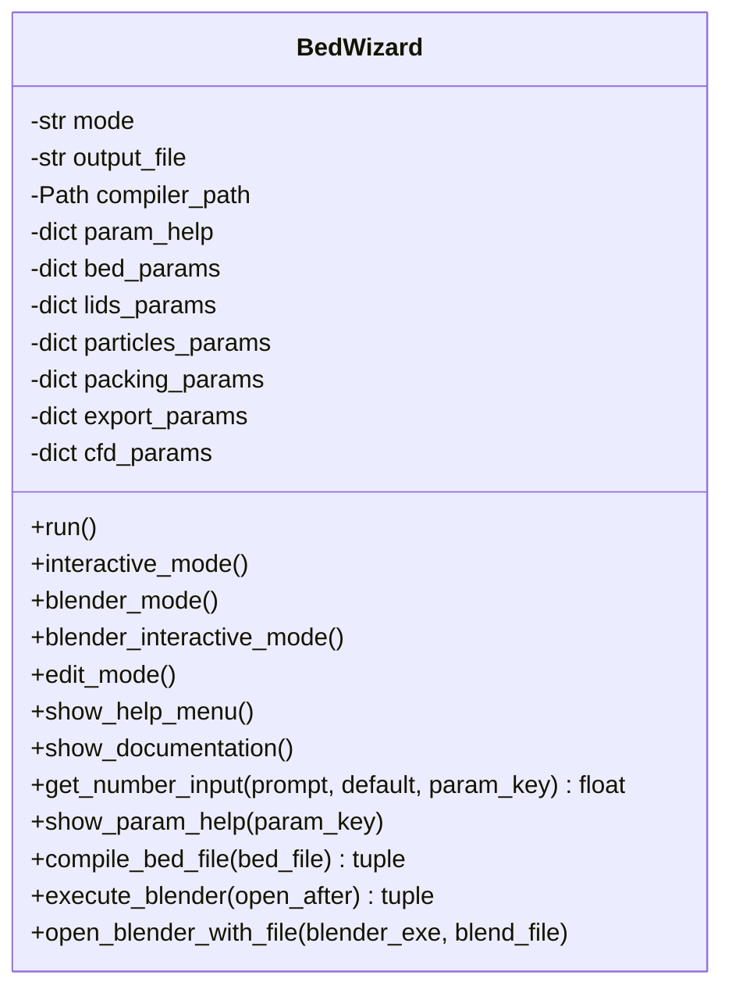

---

## 11. diagrama de metricas das classes

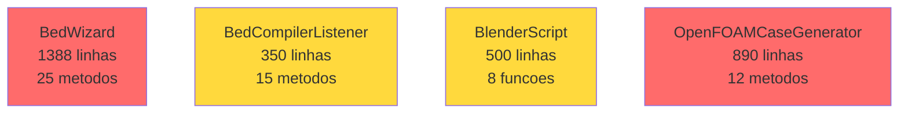

---

## 12. glossario de tipos

| tipo | descricao | exemplo |
|------|-----------|---------|
| `Path` | caminho arquivo pathlib | `Path("dsl/leito.bed")` |
| `dict` | dicionario python | `{"diameter": 0.05}` |
| `list` | lista python | `["blend", "stl"]` |
| `str` | string | `"cylinder"` |
| `float` | numero decimal | `0.05` |
| `int` | numero inteiro | `100` |
| `bool` | booleano | `True` / `False` |
| `tuple` | tupla imutavel | `(0.0, 0.0, -9.81)` |
| `Object` | objeto blender | `bpy.types.Object` |

---

## resumo de relacionamentos

### composicao
- `BedParameters` compoe 6 dataclasses
- `OpenFOAMCase` compoe 3 diretorios principais

### uso
- `BedWizard` usa `BedCompilerListener`
- `BlenderScript` usa `bpy`
- `OpenFOAMCaseGenerator` usa parametros json

### invocacao
- `BedWizard` invoca compilador
- `BedWizard` invoca blender headless
- `setup_openfoam_case.py` invoca blender para stl
- `Allrun` invoca comandos openfoam

### transformacao
- `.bed` → `.bed.json` (compilador)
- `.bed.json` → `.blend` (blender)
- `.blend` → `.stl` (exportacao)
- `.stl` → malha (snappyhexmesh)
- malha → resultados (simplefoam)
