# diagramas uml do projeto cfd-pipeline-tcc-1

## visão geral

este documento contém os diagramas uml (unified modeling language) de todas as classes e entidades do projeto, incluindo relacionamentos, atributos e métodos.

---

## 1. diagrama de classes principal

### 1.1 classe BedWizard

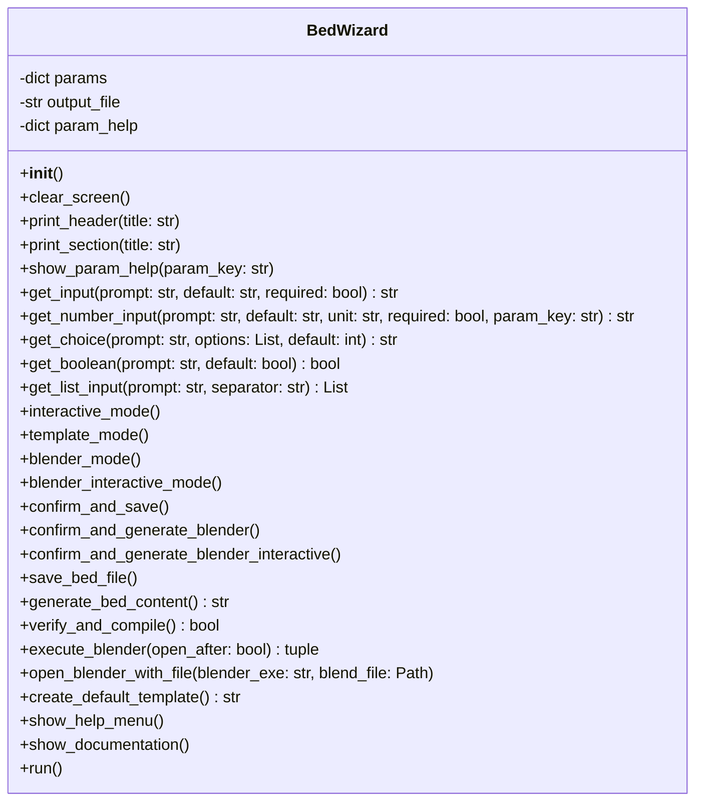

### 1.2 classe BedCompilerListener

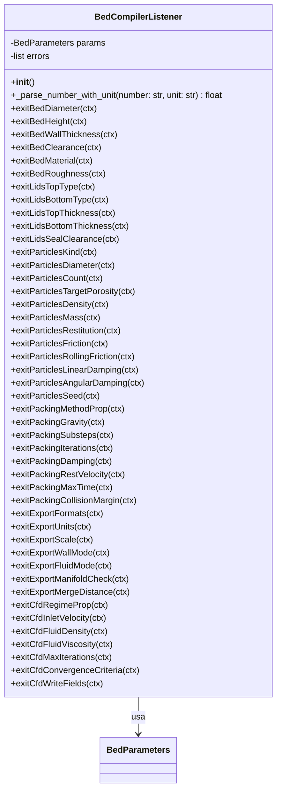

### 1.3 classe BedErrorListener

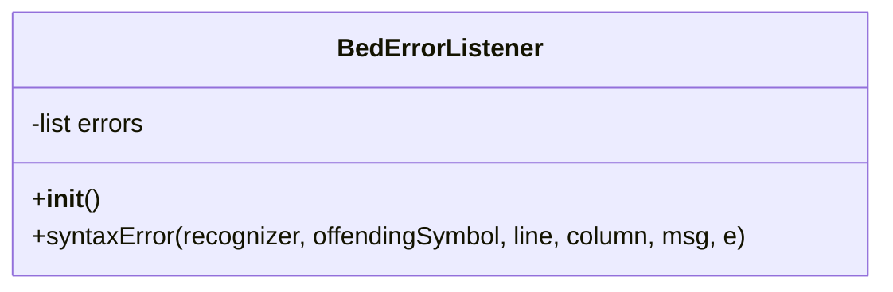

---

## 2. dataclasses (entidades de dados)

### 2.1 BedParameters (classe principal)

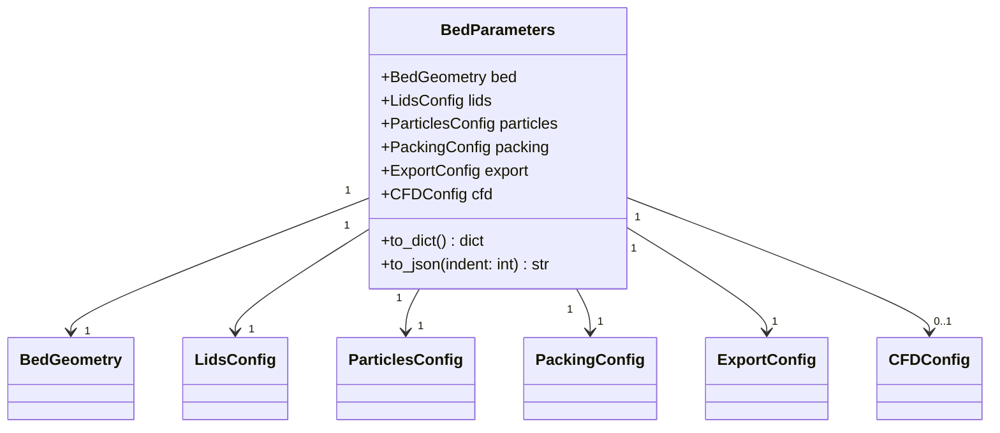

### 2.2 BedGeometry

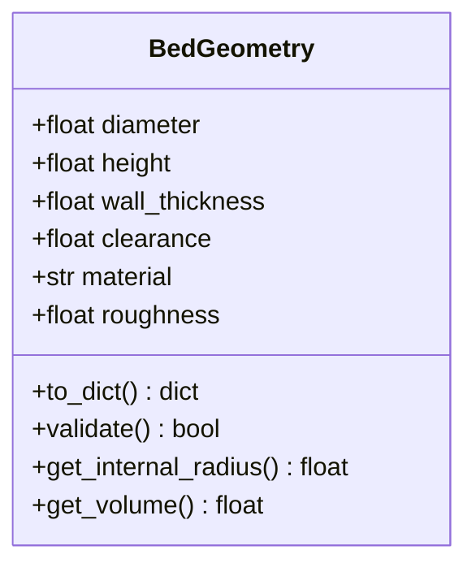

### 2.3 LidsConfig

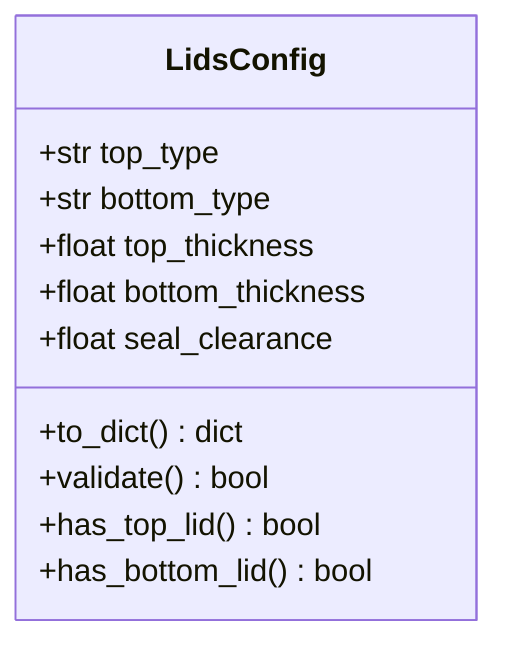

### 2.4 ParticlesConfig

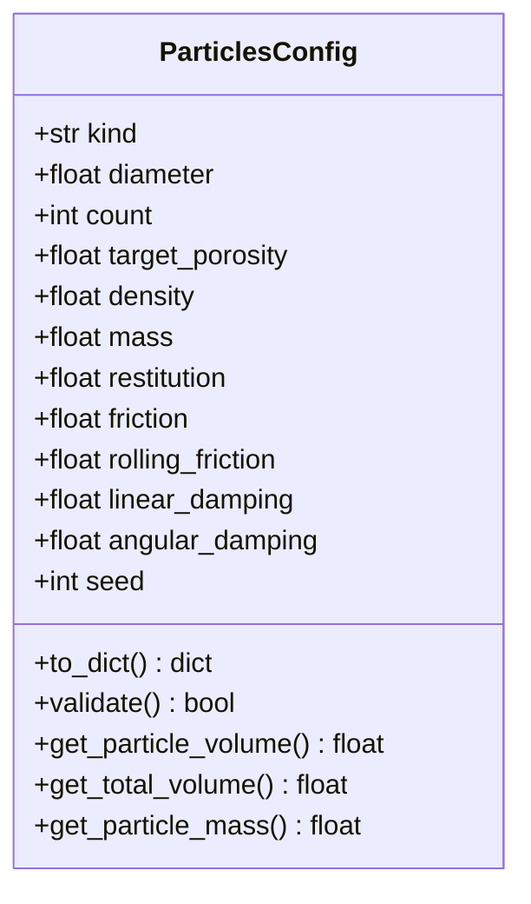

### 2.5 PackingConfig

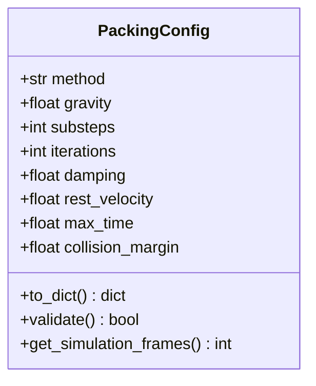

### 2.6 ExportConfig

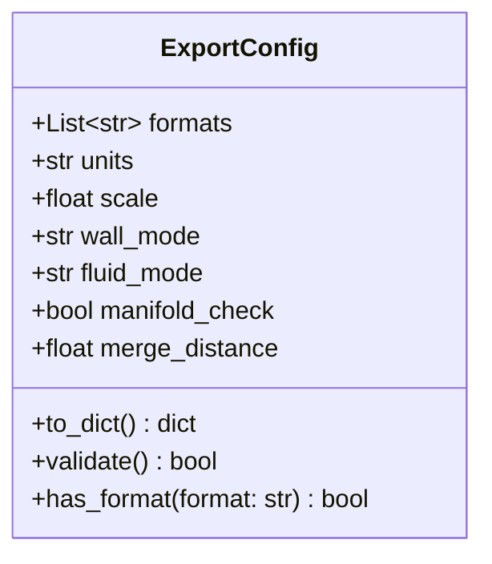

### 2.7 CFDConfig

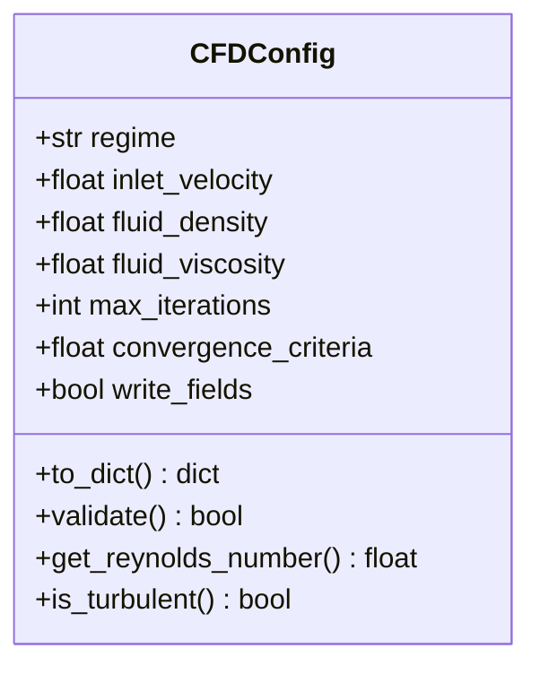

---

## 3. diagrama de relacionamentos completo

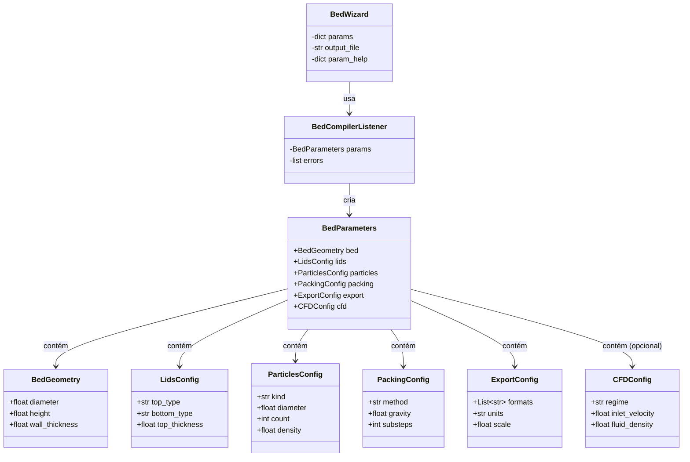

---

## 4. diagrama de sequência - geração de modelo

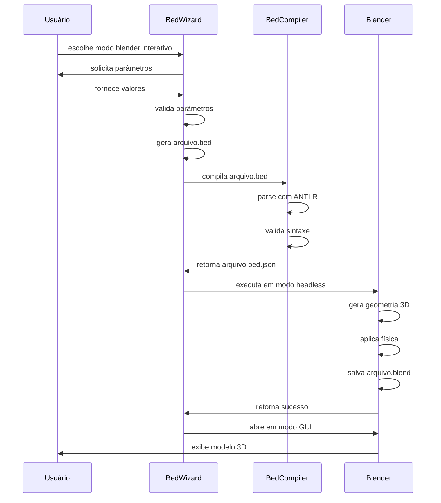

---

## 5. diagrama de estados - wizard

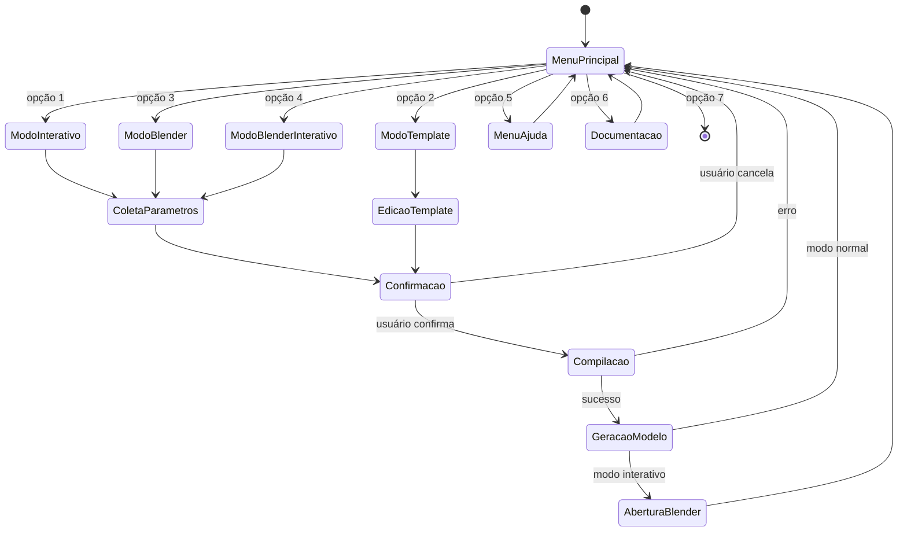

---

## 6. diagrama de componentes - arquitetura

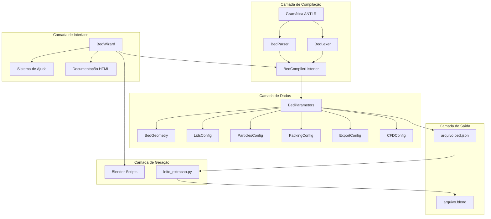

---

## 7. diagrama de casos de uso

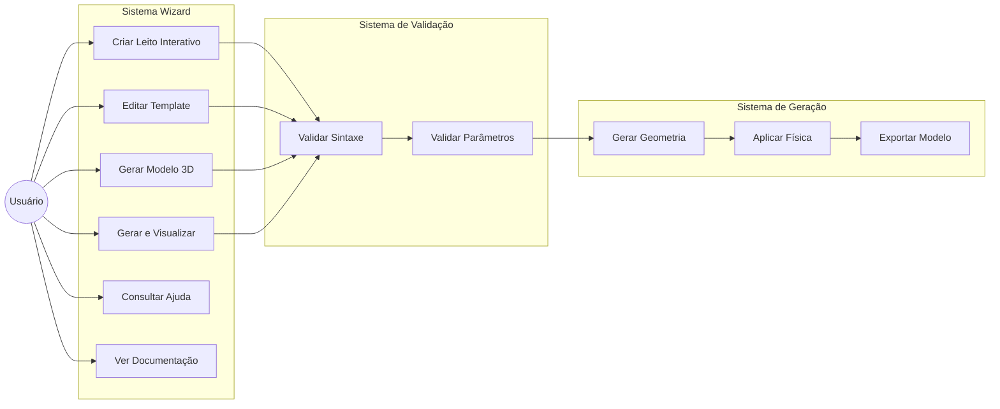

---

## 8. detalhamento de atributos por classe

### 8.1 BedWizard

| Atributo | Tipo | Descrição | Valor Inicial |
|----------|------|-----------|---------------|
| params | dict | dicionário com parâmetros coletados | {} |
| output_file | str | nome do arquivo de saída | None |
| param_help | dict | dicionário com 47 parâmetros documentados | {...} |

**Métodos Principais:**
- `run()`: loop principal do wizard
- `blender_interactive_mode()`: novo modo com abertura automática
- `execute_blender(open_after)`: execução do blender
- `show_param_help(param_key)`: exibe ajuda contextual

---

### 8.2 BedGeometry

| Atributo | Tipo | Range | Unidade | Descrição |
|----------|------|-------|---------|-----------|
| diameter | float | 0.01 - 2.0 | m | diâmetro interno do leito |
| height | float | 0.01 - 5.0 | m | altura do leito |
| wall_thickness | float | 0.0001 - 0.1 | m | espessura da parede |
| clearance | float | 0.0 - 1.0 | m | folga superior |
| material | str | - | - | material (steel, glass, etc) |
| roughness | float | 0.0 - 0.01 | m | rugosidade da superfície |

**Métodos Calculados:**
```python
get_internal_radius() -> diameter/2 - wall_thickness
get_volume() -> π * radius² * height
```

---

### 8.3 ParticlesConfig

| Atributo | Tipo | Range | Unidade | Descrição |
|----------|------|-------|---------|-----------|
| kind | str | sphere/cube/cylinder | - | formato da partícula |
| diameter | float | 0.0001 - 0.5 | m | diâmetro |
| count | int | 1 - 10000 | - | quantidade |
| target_porosity | float | 0.1 - 0.9 | - | porosidade alvo |
| density | float | 100 - 20000 | kg/m³ | densidade |
| mass | float | 0.0 - 1000.0 | g | massa individual |
| restitution | float | 0.0 - 1.0 | - | coef. restituição |
| friction | float | 0.0 - 1.0 | - | coef. atrito |
| rolling_friction | float | 0.0 - 1.0 | - | atrito rolamento |
| linear_damping | float | 0.0 - 1.0 | - | amortecimento linear |
| angular_damping | float | 0.0 - 1.0 | - | amortecimento angular |
| seed | int | 0 - 99999 | - | seed aleatória |

**Métodos Calculados:**
```python
get_particle_volume() -> (4/3) * π * (diameter/2)³  # para esferas
get_total_volume() -> particle_volume * count
get_particle_mass() -> volume * density
```

---

### 8.4 PackingConfig

| Atributo | Tipo | Range | Unidade | Descrição |
|----------|------|-------|---------|-----------|
| method | str | rigid_body | - | método empacotamento |
| gravity | float | -50.0 - 50.0 | m/s² | aceleração gravidade |
| substeps | int | 1 - 100 | - | subdivisões frame |
| iterations | int | 1 - 100 | - | iterações solver |
| damping | float | 0.0 - 1.0 | - | amortecimento global |
| rest_velocity | float | 0.0001 - 1.0 | m/s | velocidade repouso |
| max_time | float | 0.1 - 60.0 | s | tempo máximo |
| collision_margin | float | 0.00001 - 0.01 | m | margem colisão |

**Métodos Calculados:**
```python
get_simulation_frames() -> max_time * fps
# assumindo fps = 24 (padrão blender)
```

---

### 8.5 CFDConfig

| Atributo | Tipo | Range | Unidade | Descrição |
|----------|------|-------|---------|-----------|
| regime | str | laminar/turbulent_rans | - | regime escoamento |
| inlet_velocity | float | 0.001 - 100.0 | m/s | velocidade entrada |
| fluid_density | float | 0.1 - 2000.0 | kg/m³ | densidade fluido |
| fluid_viscosity | float | 1e-6 - 1.0 | Pa.s | viscosidade |
| max_iterations | int | 10 - 100000 | - | iterações máximas |
| convergence_criteria | float | 1e-10 - 1e-2 | - | critério convergência |
| write_fields | bool | true/false | - | salvar campos |

**Métodos Calculados:**
```python
get_reynolds_number() -> (density * velocity * length) / viscosity
is_turbulent() -> reynolds_number > 2300
```

---

## 9. cardinalidade dos relacionamentos

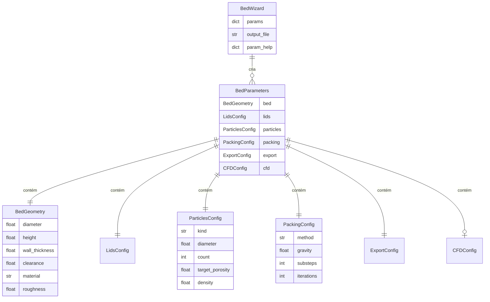

---

## 10. padrões de design utilizados

### 10.1 Padrão Builder (BedWizard)

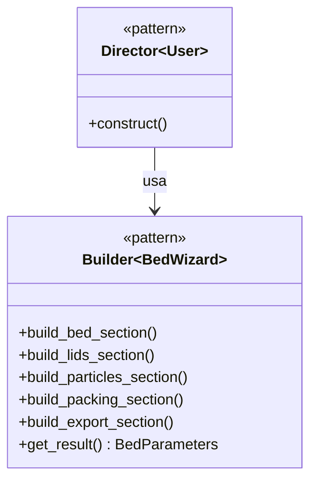

### 10.2 Padrão Visitor (BedCompilerListener)

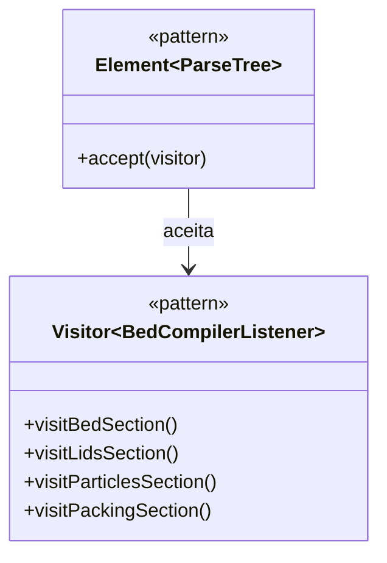

### 10.3 Padrão Facade (BedWizard.run)

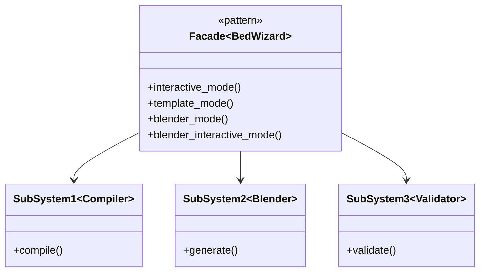

---

## 11. métricas das classes

| Classe | Atributos | Métodos | LOC | Complexidade |
|--------|-----------|---------|-----|--------------|
| BedWizard | 3 | 28 | 1388 | Alta |
| BedCompilerListener | 2 | 45 | 450 | Média |
| BedParameters | 6 | 2 | 50 | Baixa |
| BedGeometry | 6 | 3 | 30 | Baixa |
| LidsConfig | 5 | 4 | 25 | Baixa |
| ParticlesConfig | 12 | 4 | 40 | Baixa |
| PackingConfig | 8 | 2 | 30 | Baixa |
| ExportConfig | 7 | 3 | 30 | Baixa |
| CFDConfig | 7 | 3 | 30 | Baixa |

---

## 12. glossário de termos

| Termo | Significado |
|-------|-------------|
| **bed** | leito cilíndrico que contém as partículas |
| **lids** | tampas superior e inferior do leito |
| **particles** | partículas empacotadas dentro do leito |
| **packing** | processo de empacotamento físico |
| **export** | configurações de exportação do modelo |
| **cfd** | computational fluid dynamics (simulação) |
| **headless** | execução sem interface gráfica |
| **gui** | graphical user interface |
| **rigid_body** | corpo rígido com física |
| **substeps** | subdivisões de frame para precisão |
| **porosity** | percentual de vazios no empacotamento |

---

*diagramas gerados com mermaid.js*  
*compatível com github, gitlab, vscode*  
*última atualização: outubro 2024*

